# Letra200bSharp

C# library and mobile and desktop applications for printing images to a Dymo LetraTag 200B labelprinter, fork of [letra200bsharp](https://github.com/brz/letra200bsharp).

## Repository contents
- **Letra200bSharp** contains:
  - Logic for resizing / converting an input image to a matrix representing the black and white pixels of the image
  - Protocol for communicating with the device
- **Letra200bSharp.Avalonia** is a cross-platform Avalonia application with a tab each for printing an image, text, or a 1D barcode label, plus a **History** tab that keeps the last 50 successful prints (with a thumbnail) and lets you reprint a text or barcode job with one tap. Follows the system's light/dark theme and adapts its layout to the available width, from phone to desktop
  - **Letra200bSharp.Avalonia.Desktop** is the Windows/Linux desktop app. Launched with no arguments it opens the GUI; launched with arguments it instead runs headless as a CLI, with one verb per tab - `image`, `text`, `barcode` - plus `list-devices` to scan for nearby printers (run with `--help`, or `<verb> --help`, for the full option list)
  - **Letra200bSharp.Avalonia.Android** is a Avalonia android mobile application that easily lets you select a device and an image, text or barcode label for sending to the LetraTag 200B

## Screenshots
Each row shows the phone (light/dark) and desktop (light/dark) apps for that tab.

|         | Mobile | Desktop |
|---------|--------|---------|
| Image   | 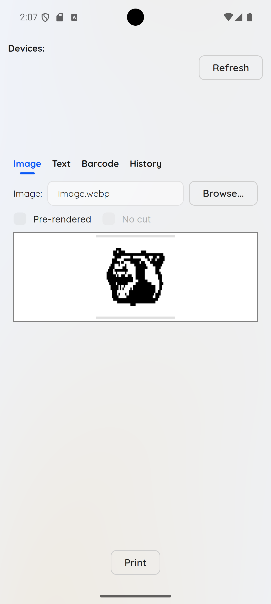 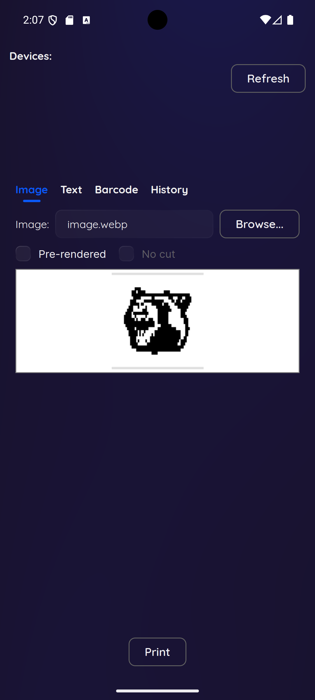 | 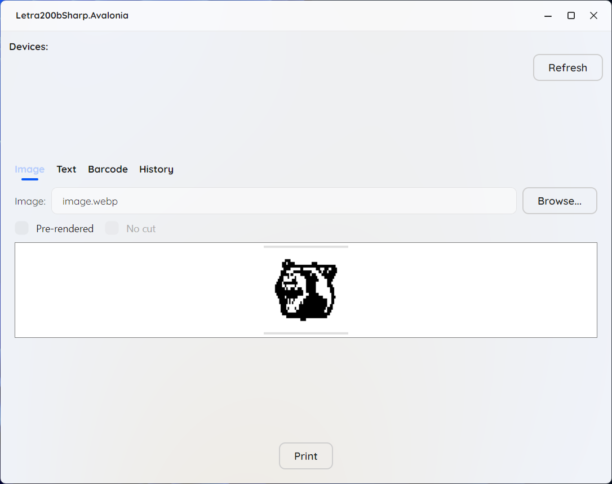 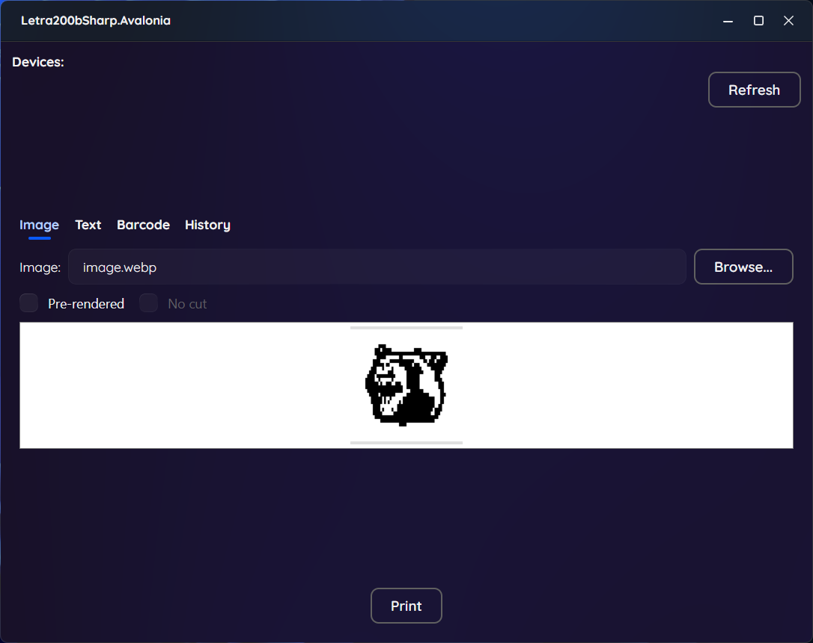 |
| Text    | 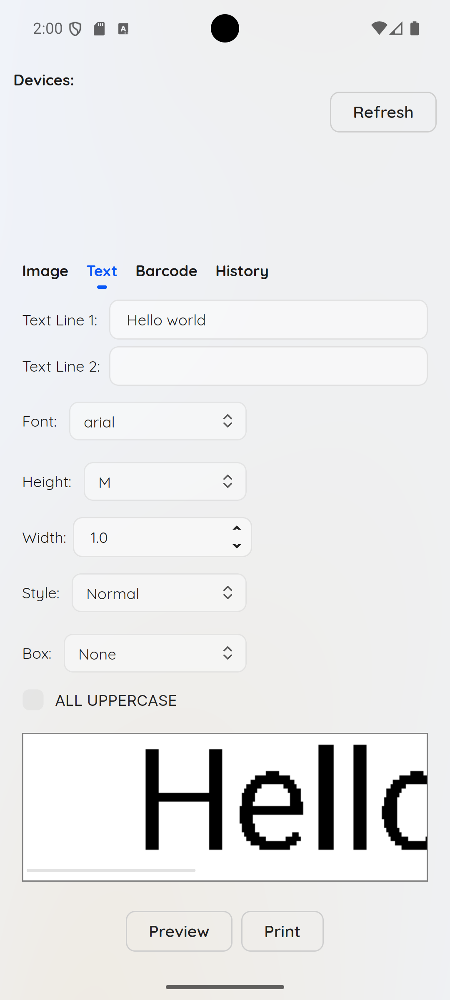 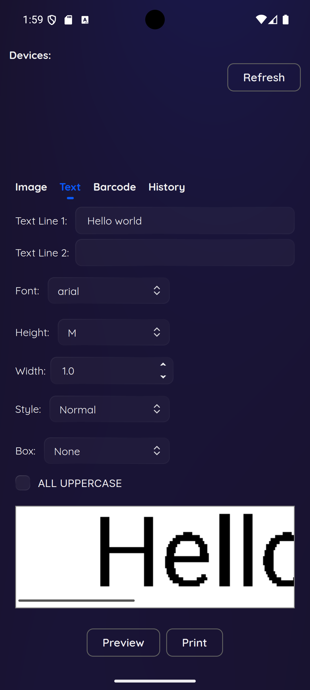 | 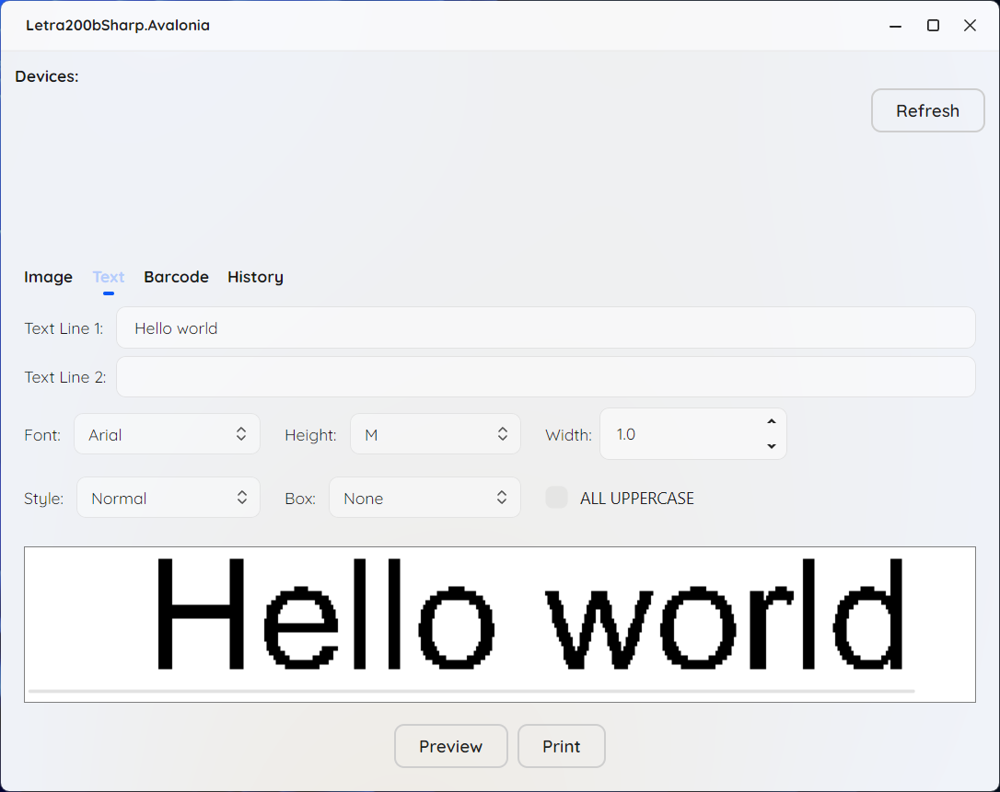 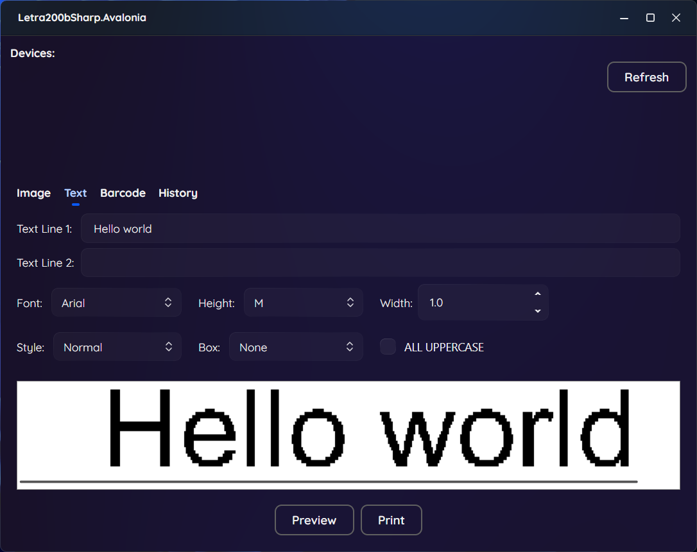 |
| Barcode | 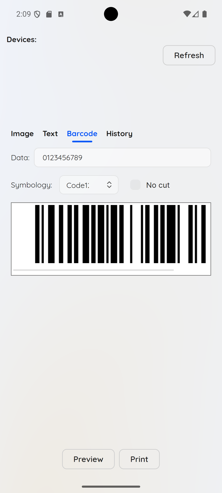 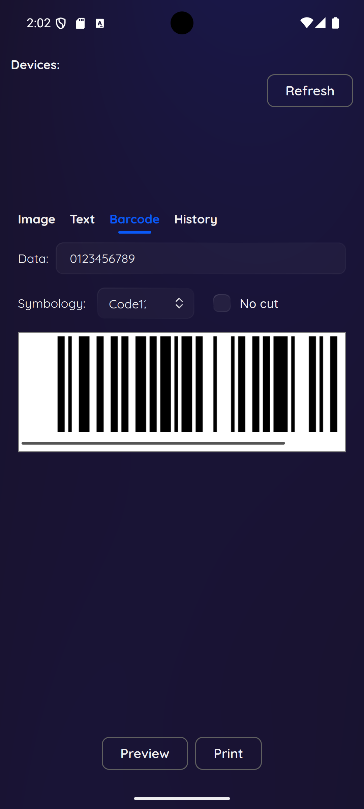 | 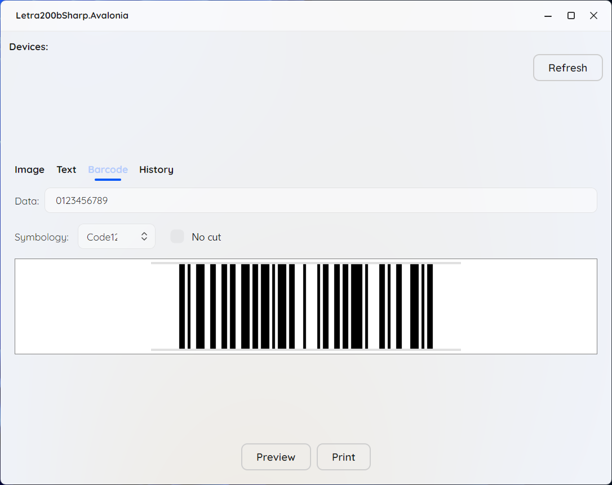 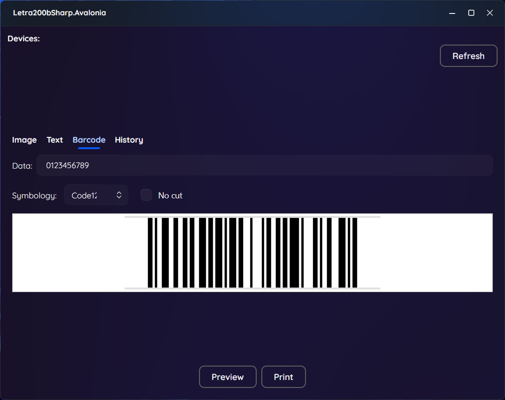 |

## Used libraries
- [SkiaSharp](https://github.com/mono/SkiaSharp) for all image processing - resizing/thresholding source images, rendering text and barcodes to a bitmap, and generating the label previews
- [InTheHand.BluetoothLE](https://github.com/inthehand/32feet) for cross-platform Bluetooth LE scanning and GATT communication with the printer (Windows, Linux, Android)
- [ZXing.Net](https://github.com/micjahn/ZXing.Net) for encoding barcode data (Code128, Code39, Codabar, ITF, EAN/UPC, ...) into the bit matrix that gets rendered onto the label
- [Avalonia](https://avaloniaui.net/) as the cross-platform UI framework behind the desktop and Android apps
- [SukiUI](https://github.com/kikipoulet/SukiUI) for the app's visual theme - light/dark styling, the toast notifications, and the busy/loading overlay on the label previews
- [CommunityToolkit.Mvvm](https://learn.microsoft.com/en-gb/dotnet/communitytoolkit/) for MVVM boilerplate - source-generated observable properties and relay commands in the view models
- [CommandLineParser](https://github.com/commandlineparser/commandline) for parsing arguments in the desktop app's headless CLI mode (`image`/`text`/`barcode`/`list-devices`)
- [CsWin32](https://github.com/microsoft/cswin32) for source-generated, type-safe P/Invoke - used to reattach the CLI's output to the parent console on Windows

## Protocol
Dymo never published a spec for the LetraTag 200B's Bluetooth LE protocol - like the two projects credited below, this one was built by reverse-engineering it. The gist:

- The printer advertises a custom GATT service (`be3dd650-2b3d-42f1-99c1-f0f749dd0678`) with two characteristics under it: "print request" (`...651...`, write-without-response) and "print reply" (`...652...`, notify) - and its device name starts with `Letratag`.
- A print job is a byte stream split into ~300-byte packets, each prefixed with a running chunk index. It always contains, in order: a small header (preamble `0xFF`, flags `0xF0`, magic `0x12 0x34`, a little-endian body length, and a checksum), then the body itself - a "start job" command, the image data, then "form feed", "status" and "end" commands. Each command is an `0x1B` escape byte followed by a command byte (`0x44` for the image data command, for example).
- The label itself is sent as a single 1-bit monochrome bitmap, packed 8 pixels per byte: 32 pixels tall (the print head's full resolution), of which only the middle 30 actually print - the first and last row are physically cut off - by whatever length the content needs.
- Once the whole job has been written, the printer replies on the "print reply" characteristic with `0x1B 0x52 <status>` - a single status byte this project maps to a human-readable result (`0`/`1` = printed, `3` = printed but the battery is low, `4` = cancelled, `6` = battery too low to print, `7` = no cassette, anything else = an unrecognized failure).

Full credit for reverse-engineering this goes to [dymo-bluetooth](https://github.com/ysfchn/dymo-bluetooth) and [lt200b](https://github.com/alexhorn/lt200b) - this project's protocol implementation ([LetraHelper.cs](letra200bsharp/LetraHelper.cs), [LetraPrinter.cs](letra200bsharp/LetraPrinter.cs)) is built directly on what they documented.

## Acknowledgements
- [letra200bsharp](https://github.com/brz/letra200bsharp) - the original C# project this repository is forked from
- [lt200b](https://github.com/alexhorn/lt200b) - the Python reference implementation the printing protocol is based on
- [dymo-bluetooth](https://github.com/ysfchn/dymo-bluetooth) - reverse-engineered documentation of the LetraTag 200B's Bluetooth LE service/characteristic UUIDs and status codes

---

Made with ❤️ (and a Dymo LetraTag 200B)
